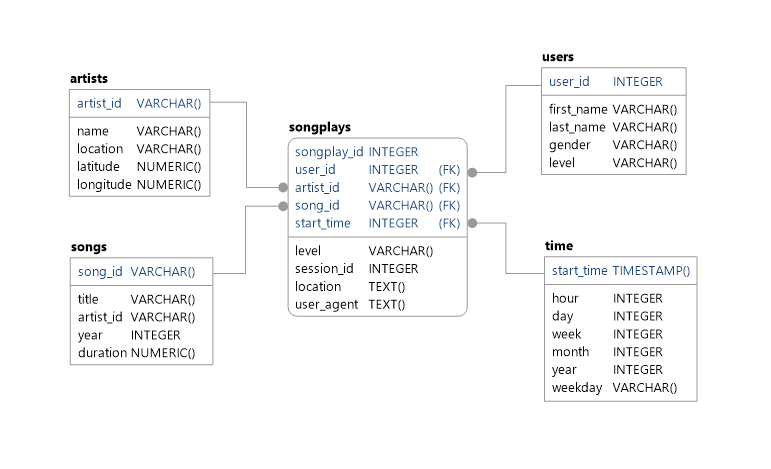

# Data Engineering Nanodegree
## Project 01 - Data Modeling with Postgres

## Introduction

This project is an introduction to Data Modeling with Postgres. A simulated startup called Sparkify needs data on song and user activity, which is provided by sample data sets from the Million Song Dataset and simulated JSON logs created by an event simulator.

The goal is to parse all song data files and JSON logs and extract data that feeds into a Postgres database via an ETL pipeline script.

## Project Description

The basis of the project is a star schema containing song and event data.  An ETL pipeline script is used to create the necessary database tables, parse each log file using python, and load the data into the database.

## Requirements

To run locally, a Postgres database should be running on the localhost, with a default database "studentdb" created, and a user "student" with a password "student".  This will allow for the creation of the new sparkify database and required tables.

Additionally, a conda environment file is included to recreate the environment.

## Database Structure



Database: sparkifydb

## Usage

```python
import foobar

foobar.pluralize('word') # returns 'words'
foobar.pluralize('goose') # returns 'geese'
foobar.singularize('phenomena') # returns 'phenomenon'
```

## Contributing
Pull requests are welcome. For major changes, please open an issue first to discuss what you would like to change.

Please make sure to update tests as appropriate.

## License
[MIT](https://choosealicense.com/licenses/mit/)
